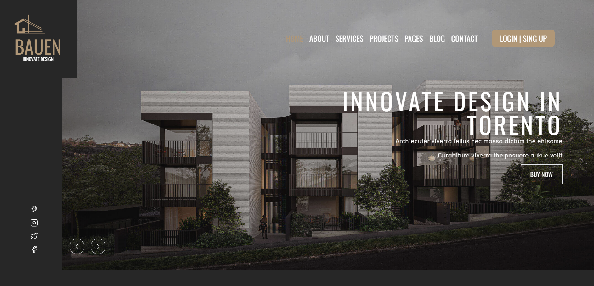

# Fullstack App


### [Demo Preview](https://buean-torento.liara.run/)

A full-stack web application with a React.js frontend and a Node.js + Express backend.



---

## 🚀 Features

- ✅ React.js frontend
- ✅ Node.js + Express backend
- ✅ RESTful API architecture
- ✅ Responsive UI
- ✅ Easy to run locally

---

## 📁 Project Structure

fullstack-app/
├── front-end/ # React frontend
├── back-end/ # Express backend
├── preview.png # App screenshot
└── README.md


---

## 🛠️ Getting Started

### Prerequisites

- Node.js v14+ and npm installed

### 1. Clone the Repository

```bash
git clone https://github.com/mohsen-barahuee/fullstack-app.git
cd fullstack-app

# Frontend
cd front-end
npm install

# Backend
cd ../back-end
npm install

# Backend
cd back-end
npm start

# In a new terminal
cd ../front-end
npm start
```

<p>Access the app at: http://localhost:3000</p>


---

Let me know if you'd like to add:
- `.env` setup instructions
- Deployment (e.g., to Vercel or Render)
- API route documentation

Happy coding!

